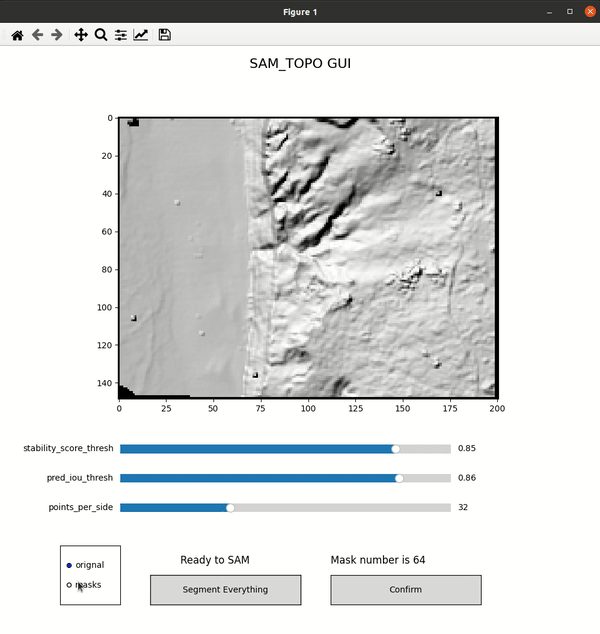
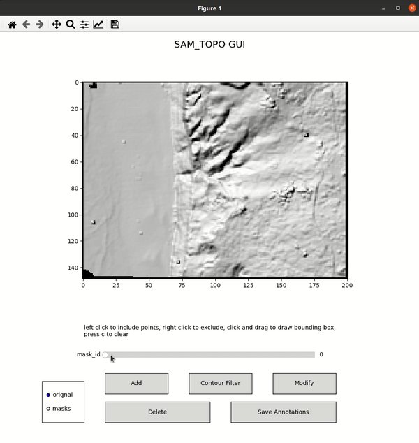
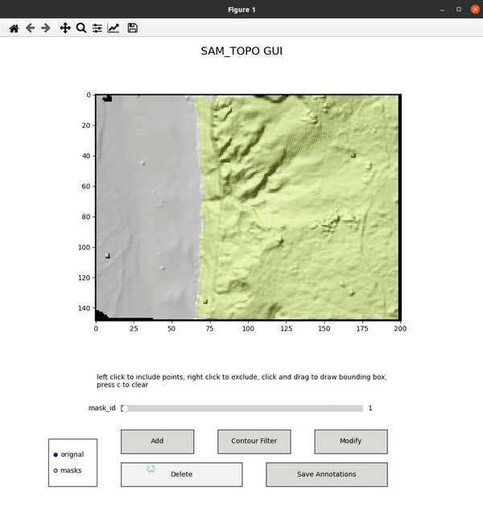
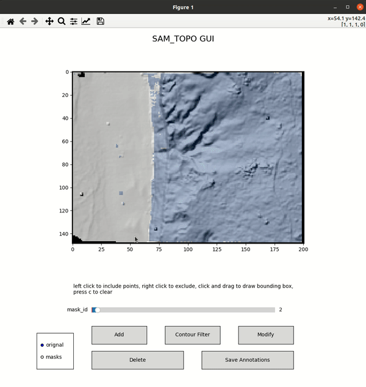
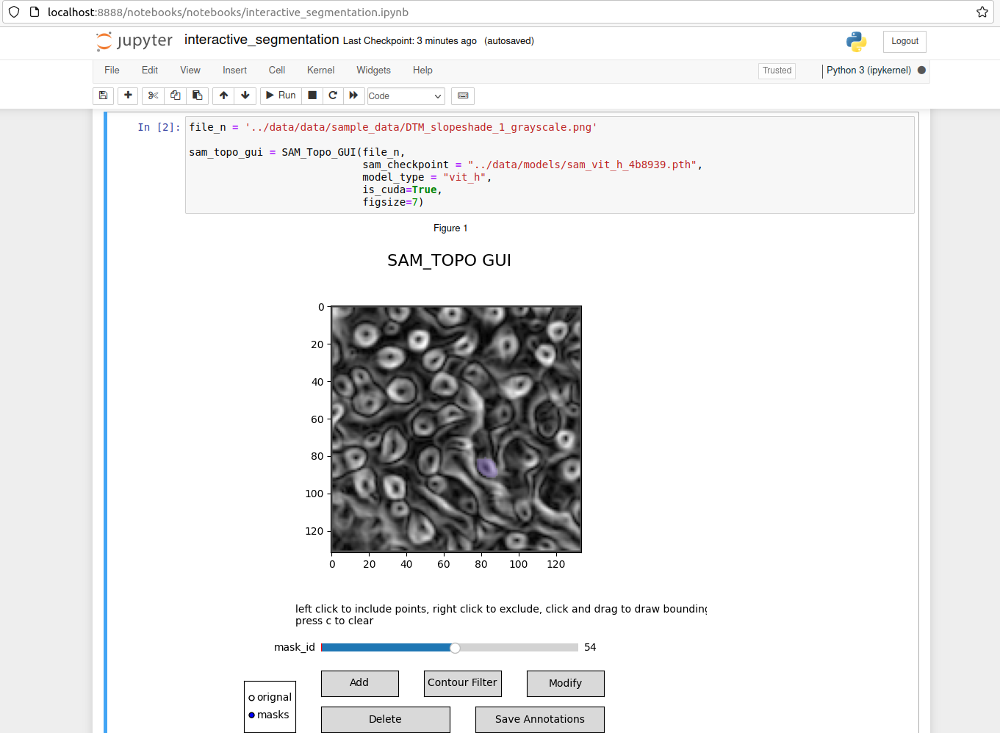

# Segment Anything Model (SAM) for Topography Data

Segment Anything (SAM) is an image segmentation model developed by Meta AI. It is designed to reduce the need for custom data annotation, training compute, and task-specific modeling expertise.

SAM for Topography data (SAM_TOPO) is a Graphical User Interface (GUI) program backed by Meta’s Segment Anything Model (SAM) to offer interactive segmentation capacities on topography datasets. 
- easy to customize: matplotlib-based GUI
- Segment everything first and then interactive segmentation for individual masks

## Installation

Please follow the instructions to install `segment-anything`: https://github.com/facebookresearch/segment-anything.git

Install `sam_topo`:
```
git clone https://github.com/OpenTopography/Segment_Anything_Model_Topography.git
cd sam_topo
pip install .
```

## Run
1. Run GUI for interactive segmentation 
```
python3 gui.py
```
2. Use the `sam_topo` library
```python
from sam_topo.gui import SAM_Topo_GUI
sam_topo_gui = SAM_Topo_GUI(img_path='../data/data/sample_data/beach_hillshade_grayscale.png', 
                            sam_checkpoint = "../data/models/sam_vit_h_4b8939.pth", 
                            model_type = "vit_h", 
                            is_cuda=True)
```
3. Tiff data preprocessing: SAM requires RGB images. `sam_topo.preprocessing` provides functions to convert tiff data to color or grayscale images. 

## Demo
1. Segment everything
<div align=center>

</div>


2. Visualize individaul mask
<div align=center>

</div>

3. Delete masks
<div align=center>

</div>

4. Modify individaul mask
<div align=center>

</div>

5. Jupyter notebook option (preview)
<div align=center>

</div>


## Citation
Chen, Z., Scott, C., Schwarz, M.F., Johnstone, S., Crosby, C.J. and Arrowsmith, R., 2023. Segmenting geologic landforms using zero-shot deep learning and lidar topography. AGU23. 
https://agu.confex.com/agu/fm23/meetingapp.cgi/Paper/1352775

## Meta AI Segment Anything

```
@article{kirillov2023segany,
  title={Segment Anything},
  author={Kirillov, Alexander and Mintun, Eric and Ravi, Nikhila and Mao, Hanzi and Rolland, Chloe and Gustafson, Laura and Xiao, Tete and Whitehead, Spencer and Berg, Alexander C. and Lo, Wan-Yen and Doll{\'a}r, Piotr and Girshick, Ross},
  journal={arXiv:2304.02643},
  year={2023}
}
```
